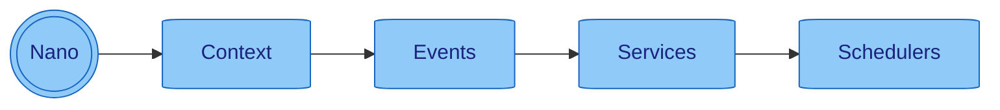

# 🧬 Project Nano

[//]: # ([![Build][build_shield]][build_link])

[//]: # ([![Maintainable][maintainable_shield]][maintainable_link])

[//]: # ([![Coverage][coverage_shield]][coverage_link])
[![Issues][issues_shield]][issues_link]
[![Commit][commit_shield]][commit_link]
[![License][license_shield]][license_link]
[![Central][central_shield]][central_link]
[![Tag][tag_shield]][tag_link]
[![Javadoc][javadoc_shield]][javadoc_link]
[![Size][size_shield]][size_shield]
![Label][label_shield]
![Label][java_version]

> [Introduction](#-introduction)
> | [Core Concept](#-core-concept)
> | [Mechanics](#-mechanics)
> | [Components](#-components)
> | [Getting Started](#-getting-started)
> | [Build Nano](#-build-nano)
> | [Benefits](#-benefits-of-nano)

## 🖼️ Introduction

**Back to basics and forget about frameworks!**

Nano is a lightweight concept which makes it easier for developer to write microservices in
**functional, fluent, chaining, plain, modern java** with a nano footprint.
Nano is also designed to be fully compilable with [GraalVM](https://www.graalvm.org) to create native executables.
To enhance efficiency and performance, Nano utilizes non-blocking virtual threads from [Project Loom](https://jdk.java.net/loom/).

## 📐 Core Concept

Nano handles threads for you and provides a basic construct for event driven architecture.
It's providing a simple way to write microservices in a functional fluent and chaining style.
**Objects are less needed** thanks to the underlying [TypeMap](https://github.com/YunaBraska/type-map).
Nano provides full access to all internal components, resulting in very few private methods or fields.

[Read more...](docs/info/concept/README.md)

## 📚 Components

**All you need to know are few classes:**
[Context](docs/context/README.md),
[Events](docs/events/README.md),
[Schedulers](docs/schedulers/README.md),
[Services](docs/services/README.md)



## ⚙️ Mechanics

* [Error Handling](docs/info/errorhandling/README.md)
* [Registers](docs/registers/README.md) _(ConfigRegister, TypeConversionRegister, LogFormatRegister,
  EventChannelRegister)_
* [Integrations](docs/integrations/README.md) _(🌱 Spring Boot, 🧑‍🚀 Micronaut, 🐸 Quarkus)_
* [Code Examples](src/test/java/org/nanonative/nano/examples)

## 📚 Getting Started

Maven example

```xml

<dependency>
    <groupId>org.nanonative</groupId>
    <artifactId>nano</artifactId>
    <version>1.0.0</version>
</dependency>
```

Gradle example

```groovy
dependencies {
    implementation 'org.nanonative:nano:1.0.0'
}
```

Simple Nano example with [HttpServer](docs/services/httpserver/README.md) _(a default service)_

```java
public static void main(final String[] args) {
    // Start Nano with HttpServer
    final Nano app = new Nano(args, new HttpServer());

    // listen to /hello
    app.subscribeEvent(EVENT_HTTP_REQUEST, event -> event.payloadOpt(HttpObject.class)
        .filter(HttpObject::isMethodGet)
        .filter(request -> request.pathMatch("/hello"))
        .ifPresent(request -> request.response().body(Map.of("Hello", System.getProperty("user.name"))).respond(event)));

    // Override error handling for HTTP requests
    app.subscribeEvent(EVENT_APP_UNHANDLED, event -> event.payloadOpt(HttpObject.class).ifPresent(request ->
        request.response().body("Internal Server Error [" + event.error().getMessage() + "]").statusCode(500).respond(event)));
}
```

## 🔨 Build Nano

add the native-image profile to your `pom.xml` and run `mvn package -Pnative-image`

```xml

<profiles>
    <!-- NATIVE COMPILATION -->
    <plugin>
        <groupId>org.graalvm.nativeimage</groupId>
        <artifactId>native-image-maven-plugin</artifactId>
        <version>21.2.0</version>
        <configuration>
            <imageName>ExampleApp</imageName>
            <mainClass>de.yuna.berlin.nativeapp.helper.ExampleApp</mainClass>
            <buildArgs>
                <!-- Reduces the image size - Ensures the native image doesn't include the JVM as a fallback option -->
                <buildArg>--no-fallback</buildArg>
                <!-- Disables the use of the GraalVM compilation server -->
                <buildArg>--no-server</buildArg>
                <!-- Improve startup time - Initialize classes at build time rather than at runtime -->
                <buildArg>--initialize-at-build-time</buildArg>
                <!-- Include all files under /resources -->
                <buildArg>-H:IncludeResources=resources/config/.*</buildArg>
            </buildArgs>
        </configuration>
        <executions>
            <execution>
                <goals>
                    <goal>native-image</goal>
                </goals>
                <phase>package</phase>
            </execution>
        </executions>
    </plugin>
</profiles>
```

## ✨ Benefits of Nano:

* 🧩 **Modular Design**: Nano's architecture is modular, making it easy to understand, extend, and maintain.
* 🧵 **Concurrency Management**: Efficiently handle asynchronous tasks using advanced thread management.
* 📡 **Event-Driven Architecture**: Robust event handling that simplifies communication between different parts of your
  application.
* ⚙️ **Flexible Configuration**: Configure your application using environment variables, system properties, or
  command-line
  arguments.
* 📊 **Robust Logging and Error Handling**: Integrated logging and comprehensive error handling mechanisms for reliable
  operation.
* 🚀 **Scalable and Performant**: Designed with scalability and performance in mind to handle high-concurrency scenarios.
* 🪶 **Lightweight & Fast**: Starts in milliseconds, uses ~10MB memory.
* 🌿 **Pure Java, Pure Simplicity**: No reflections, no regex, no unnecessary magic.
* ⚡ **GraalVM Ready**: For ahead-of-time compilation and faster startup.
* 🔒 **Minimal Dependencies**: Reduces CVE risks and simplifies updates.
* 🌊 **Fluent & Stateless**: Intuitive API design for easy readability and maintenance.
* 🛠️ **Rapid Service Development**: Build real services in minutes.

## 🤝 Contributing

Contributions to Nano are welcome! Please refer to our [Contribution Guidelines](CONTRIBUTING.md) for more information.

## 📜 License

Nano is open-source software licensed under the [Apache license](LICENSE).

## 🙋‍ Support

If you encounter any issues or have questions, please file an
issue [here](https://github.com/nanonative/nano/issues/new/choose).

## 🌐 Stay Connected

* [GitHub](https://github.com/NanoNative)
* [X (aka Twitter)](https://twitter.com/YunaMorgenstern)
* [Mastodon](https://hachyderm.io/@LunaFreyja)
* [LinkedIn](https://www.linkedin.com/in/yuna-morgenstern-6662a5145/)


[build_shield]: https://github.com/nanonative/nano/workflows/MVN_RELEASE/badge.svg

[build_link]: https://github.com/nanonative/nano/actions?query=workflow%3AMVN_RELEASE

[maintainable_shield]: https://img.shields.io/codeclimate/maintainability/nanonative/nano?style=flat-square

[maintainable_link]: https://codeclimate.com/github/nanonative/nano/maintainability

[coverage_shield]: https://img.shields.io/codeclimate/coverage/nanonative/nano?style=flat-square

[coverage_link]: https://codeclimate.com/github/nanonative/nano/test_coverage

[issues_shield]: https://img.shields.io/github/issues/nanonative/nano?style=flat-square

[issues_link]: https://github.com/nanonative/nano/issues/new/choose

[commit_shield]: https://img.shields.io/github/last-commit/nanonative/nano?style=flat-square

[commit_link]: https://github.com/nanonative/nano/commits/main

[license_shield]: https://img.shields.io/github/license/nanonative/nano?style=flat-square

[license_link]: https://github.com/nanonative/nano/blob/main/LICENSE

[dependency_shield]: https://img.shields.io/librariesio/github/nanonative/nano?style=flat-square

[dependency_link]: https://libraries.io/github/nanonative/nano

[central_shield]: https://img.shields.io/maven-central/v/org.nanonative/nano?style=flat-square

[central_link]:https://search.maven.org/artifact/org.nanonative/nano

[tag_shield]: https://img.shields.io/github/v/tag/nanonative/nano?style=flat-square

[tag_link]: https://github.com/nanonative/nano/releases

[javadoc_shield]: https://javadoc.io/badge2/org.nanonative/nano/javadoc.svg?style=flat-square

[javadoc_link]: https://javadoc.io/doc/org.nanonative/nano

[size_shield]: https://img.shields.io/github/repo-size/nanonative/nano?style=flat-square

[label_shield]: https://img.shields.io/badge/Yuna-QueenInside-blueviolet?style=flat-square

[gitter_shield]: https://img.shields.io/gitter/room/nanonative/nano?style=flat-square

[gitter_link]: https://gitter.im/nano/Lobby

[java_version]: https://img.shields.io/badge/java-21-blueviolet?style=flat-square


