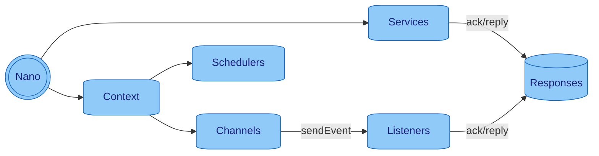

# 🧬 Project Nano

[//]: # ([![Build][build_shield]][build_link])

[//]: # ([![Maintainable][maintainable_shield]][maintainable_link])

[//]: # ([![Coverage][coverage_shield]][coverage_link])
[![Issues][issues_shield]][issues_link]
[![Commit][commit_shield]][commit_link]
[![License][license_shield]][license_link]
[![Central][central_shield]][central_link]
[![Tag][tag_shield]][tag_link]
[![Javadoc][javadoc_shield]][javadoc_link]
[![Size][size_shield]][size_shield]
![Label][label_shield]
![Label][java_version]

> [Introduction](#-introduction)
> | [Core Concept](#-core-concept)
> | [Mechanics](#-mechanics)
> | [Components](#-components)
> | [Getting Started](#-getting-started)
> | [Build Nano](#-build-nano)
> | [Benefits](#-benefits-of-nano)

## 🖼️ Introduction

**Back to basics and forget about frameworks!**

Nano is a lightweight approach which makes it easier for developer to write microservices in
**functional, fluent, chaining, plain, modern java** with a nano footprint. It breaks away from traditional OOP patterns. Instead of creating complex object hierarchies with Controllers, Services, and Repositories, Nano uses **static event listeners** that react to events in a functional, stateless manner.

**Key Philosophy:**
- **Static Methods, Not Objects**: Business logic lives in static methods, not in service objects
- **Event-Driven Communication**: Everything communicates through events, not direct method calls
- **Universal Services**: Services are generic connectors for external systems (databases, HTTP, queues) - no business logic
- **TypeMap Everywhere**: Built-in type conversion and data transformation using TypeMap
- **Global Error Handling**: Even errors are events that can be subscribed to and handled globally

Nano is designed to be fully compilable with [GraalVM](https://www.graalvm.org) to create native executables and utilizes non-blocking virtual threads from [Project Loom](https://jdk.java.net/loom/) for maximum performance.

## 📐 Core Concept

**Think Events, Not Objects!**

Nano revolutionizes microservice development by eliminating the need for complex object hierarchies. Instead of creating Controllers, Services, and Repositories, you simply **listen to events** and react with static methods.

**How It Works:**
1. **Events Flow Through Everything**: HTTP requests, database operations, errors - all are events
2. **Static Listeners React**: Your business logic lives in static methods that subscribe to events
3. **Services Are Universal Connectors**: Services handle external integrations (HTTP, databases, queues) - no business logic
4. **TypeMap Handles Data**: Automatic type conversion for JSON, XML, and any data format
5. **Global Error Handling**: Subscribe to error events for centralized error management

**Example - Traditional vs Nano:**
```java
// ❌ Traditional Spring Boot
@RestController
public class UserController {
    @Autowired private UserService userService;
    @PostMapping("/users")
    public ResponseEntity<User> createUser(@RequestBody UserDto dto) {
        return ResponseEntity.ok(userService.createUser(dto));
    }
}

// ✅ Nano - Static Event Handling
public class UserController {
    public static void handleCreateUser(Event<HttpObject, HttpObject> event) {
        event.payloadOpt()
            .filter(HttpObject::isMethodPost)
            .filter(req -> req.pathMatch("/users"))
            .ifPresent(req -> {
                // Business logic here - no objects needed!
                event.context().sendEvent(EVENT_CREATE_USER, req.bodyAsJson().asMap());
                req.createResponse().statusCode(200).respond(event);
            });
    }
}
```

[Read more...](docs/info/concept/README.md)

## 📚 Components

**All you need to know are few classes:**
[Context](docs/context/README.md),
[Events](docs/events/README.md),
[Schedulers](docs/schedulers/README.md),
[Services](docs/services/README.md)



## ⚙️ Mechanics

**The Nano Way: Static, Event-Driven, and Stateless**

Nano's architecture is fundamentally different from traditional frameworks:

**🏗️ Architecture Principles:**
- **Static Methods for Business Logic**: No need for service objects - just static methods that react to events
- **Services as Universal Connectors**: Services handle external integrations only (databases, HTTP, queues) - no business logic
- **Event-Driven Communication**: Everything flows through events - HTTP requests, database operations, errors
- **TypeMap for Data Handling**: Automatic type conversion and transformation for JSON, XML, and any data format
- **Global Error Handling**: Subscribe to error events for centralized error management
- **Built-in Logging**: Context automatically provides logging - no setup required

**🔄 How It All Connects:**
1. **HTTP Request** → **Event** → **Static Listener** → **Business Logic**
2. **Database Operation** → **Event** → **Database Service** → **Response Event**
3. **Error Occurs** → **Error Event** → **Global Error Handler** → **Error Response**

* [Error Handling](docs/info/errorhandling/README.md)
* [Registers](docs/registers/README.md) _(ConfigRegister, TypeConversionRegister, LogFormatRegister,
  EventChannelRegister)_
* [Integrations](docs/integrations/README.md) _(🌱 Spring Boot, 🧑‍🚀 Micronaut, 🐸 Quarkus)_
* [Code Examples](src/test/java/org/nanonative/nano/examples)

## 📚 Getting Started

Maven example

```xml
<dependency>
    <groupId>org.nanonative</groupId>
    <artifactId>nano</artifactId>
    <version>1.0.0</version>
</dependency>
```

Gradle example

```groovy
dependencies {
    implementation 'org.nanonative:nano:1.0.0'
}
```

### Quick Start

**New to Nano?** Start with our [Quick Start Guide](docs/quickstart/README.md) for a complete walkthrough.

**Building a web API?** Check out our [HTTP Service Guide](docs/services/httpserver/README.md) with real-world examples.

**Need architecture guidance?** See our [Architecture Patterns](docs/architecture/README.md) for best practices.

**Having issues?** Our [Troubleshooting Guide](docs/troubleshooting/README.md) covers common problems and solutions.

### Simple Example

Here's a basic HTTP server with Nano showing the event-driven approach:

```java
public static void main(final String[] args) {
    // Start Nano with HttpServer
    final Nano app = new Nano(args, new HttpServer());

    // Static method handles GET /hello - no @Controller needed!
    app.subscribeEvent(EVENT_HTTP_REQUEST, MyController::handleHello);

    // Global error handling - even errors are events!
    app.subscribeError(EVENT_HTTP_REQUEST, MyController::handleError);
}

public class MyController {
    // Static method for business logic - no objects, no state!
    public static void handleHello(Event<HttpObject, HttpObject> event) {
        event.payloadOpt()
            .filter(HttpObject::isMethodGet)
            .filter(request -> request.pathMatch("/hello"))
            .ifPresent(request -> request.createResponse()
                .body(Map.of("Hello", System.getProperty("user.name")))
                .respond(event));
    }
    
    // Global error handling - subscribe to error events!
    public static void handleError(Event<?, ?> event) {
        event.payloadAck()
            .createResponse()
            .body("Internal Server Error [" + event.error().getMessage() + "]")
            .statusCode(500)
            .respond(event);
    }
}
```

### Real-World Example

For a complete user management system, see our [Simple User API Example](src/test/java/org/nanonative/nano/examples/SimpleUserApi.java).

## 🔨 Build Nano

add the native-image profile to your `pom.xml` and run `mvn package -Pnative-image`

```xml

<profiles>
    <!-- NATIVE COMPILATION -->
    <plugin>
        <groupId>org.graalvm.nativeimage</groupId>
        <artifactId>native-image-maven-plugin</artifactId>
        <version>21.2.0</version>
        <configuration>
            <imageName>ExampleApp</imageName>
            <mainClass>de.yuna.berlin.nativeapp.helper.ExampleApp</mainClass>
            <buildArgs>
                <!-- Reduces the image size - Ensures the native image doesn't include the JVM as a fallback option -->
                <buildArg>--no-fallback</buildArg>
                <!-- Disables the use of the GraalVM compilation server -->
                <buildArg>--no-server</buildArg>
                <!-- Improve startup time - Initialize classes at build time rather than at runtime -->
                <buildArg>--initialize-at-build-time</buildArg>
                <!-- Include all files under /resources -->
                <buildArg>-H:IncludeResources=resources/config/.*</buildArg>
            </buildArgs>
        </configuration>
        <executions>
            <execution>
                <goals>
                    <goal>native-image</goal>
                </goals>
                <phase>package</phase>
            </execution>
        </executions>
    </plugin>
</profiles>
```

## ✨ Benefits of Nano:

**🎯 Revolutionary Approach:**
* 🚫 **No More Object Hierarchies**: Forget Controllers, Services, Repositories - just static methods and events!
* 📡 **Event-Driven Everything**: HTTP requests, database operations, errors - all flow through events
* 🔧 **Universal Services**: Services are generic connectors for external systems - no business logic mixed in
* 🗺️ **TypeMap Magic**: Automatic type conversion for JSON, XML, and any data format - no manual mapping needed
* 🛡️ **Global Error Handling**: Subscribe to error events for centralized error management
* 📝 **Built-in Logging**: Context automatically provides logging - no setup, no configuration needed

**⚡ Performance & Simplicity:**
* 🪶 **Lightweight & Fast**: Starts in milliseconds, uses ~10MB memory
* 🌿 **Pure Java, Pure Simplicity**: No reflections, no regex, no unnecessary magic
* ⚡ **GraalVM Ready**: For ahead-of-time compilation and faster startup
* 🔒 **Minimal Dependencies**: Reduces CVE risks and simplifies updates
* 🧵 **Virtual Threads**: Built-in support for Project Loom's virtual threads
* 🚀 **Scalable and Performant**: Designed for high-concurrency scenarios

**🛠️ Developer Experience:**
* 🌊 **Fluent & Stateless**: Intuitive API design for easy readability and maintenance
* 🧩 **Modular Design**: Easy to understand, extend, and maintain
* ⚙️ **Flexible Configuration**: Environment variables, system properties, command-line arguments
* 🧪 **Test-Friendly**: Easy to test with fake services and event listeners
* 🛠️ **Rapid Development**: Build real services in minutes, not hours

## 🤝 Contributing

Contributions to Nano are welcome! Please refer to our [Contribution Guidelines](CONTRIBUTING.md) for more information.

## 📜 License

Nano is open-source software licensed under the [Apache license](LICENSE).

## 🙋‍ Support

If you encounter any issues or have questions, please file an
issue [here](https://github.com/nanonative/nano/issues/new/choose).

## 🌐 Stay Connected

* [GitHub](https://github.com/NanoNative)
* [X (aka Twitter)](https://twitter.com/YunaMorgenstern)
* [Mastodon](https://hachyderm.io/@LunaFreyja)
* [LinkedIn](https://www.linkedin.com/in/yuna-morgenstern-6662a5145/)


[build_shield]: https://github.com/nanonative/nano/workflows/MVN_RELEASE/badge.svg

[build_link]: https://github.com/nanonative/nano/actions?query=workflow%3AMVN_RELEASE

[maintainable_shield]: https://img.shields.io/codeclimate/maintainability/nanonative/nano?style=flat-square

[maintainable_link]: https://codeclimate.com/github/nanonative/nano/maintainability

[coverage_shield]: https://img.shields.io/codeclimate/coverage/nanonative/nano?style=flat-square

[coverage_link]: https://codeclimate.com/github/nanonative/nano/test_coverage

[issues_shield]: https://img.shields.io/github/issues/nanonative/nano?style=flat-square

[issues_link]: https://github.com/nanonative/nano/issues/new/choose

[commit_shield]: https://img.shields.io/github/last-commit/nanonative/nano?style=flat-square

[commit_link]: https://github.com/nanonative/nano/commits/main

[license_shield]: https://img.shields.io/github/license/nanonative/nano?style=flat-square

[license_link]: https://github.com/nanonative/nano/blob/main/LICENSE

[dependency_shield]: https://img.shields.io/librariesio/github/nanonative/nano?style=flat-square

[dependency_link]: https://libraries.io/github/nanonative/nano

[central_shield]: https://img.shields.io/maven-central/v/org.nanonative/nano?style=flat-square

[central_link]:https://search.maven.org/artifact/org.nanonative/nano

[tag_shield]: https://img.shields.io/github/v/tag/nanonative/nano?style=flat-square

[tag_link]: https://github.com/nanonative/nano/releases

[javadoc_shield]: https://javadoc.io/badge2/org.nanonative/nano/javadoc.svg?style=flat-square

[javadoc_link]: https://javadoc.io/doc/org.nanonative/nano

[size_shield]: https://img.shields.io/github/repo-size/nanonative/nano?style=flat-square

[label_shield]: https://img.shields.io/badge/Yuna-QueenInside-blueviolet?style=flat-square

[gitter_shield]: https://img.shields.io/gitter/room/nanonative/nano?style=flat-square

[gitter_link]: https://gitter.im/nano/Lobby

[java_version]: https://img.shields.io/badge/java-21-blueviolet?style=flat-square


