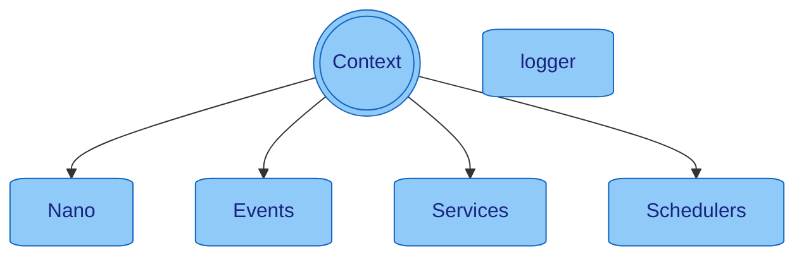

> [Home](../../README.md) / [Components](../../README.md#-components)

[**> Context <**](README.md)
| [Events](../events/README.md)
| [Schedulers](../schedulers/README.md)
| [Services](../services/README.md)

# Context

**Context - The Central Hub of Nano**

The [Context](../context/README.md) object is the central hub of Nano that provides access to all core components and functionality. It's designed to eliminate the need for complex configuration objects and dependency injection.

**What Context Provides:**
- **TypeMap Integration**: Automatic type conversion and data transformation
- **Built-in Logging**: No setup required - logging is automatically available
- **Event Management**: Send and subscribe to events throughout your application
- **Service Access**: Interact with all services and external integrations
- **Configuration**: Access all configuration values with type conversion
- **Scheduling**: Run tasks and scheduled operations
- **Tracing**: Built-in tracing and monitoring capabilities

**Key Philosophy:**
- **No Custom Config Classes**: Context contains all needed information including type conversion
- **TypeMap Everywhere**: All data flows through TypeMap for consistent handling
- **Automatic Logging**: Context automatically provides logging for the class it's initialized with
- **Event-Driven**: Everything communicates through events, not direct method calls



### Examples

#### TypeMap Integration - The Heart of Data Handling

Context provides seamless TypeMap integration for all data handling, eliminating the need for DTOs and complex object mapping:

```java
public static void handleUserRequest(Event<HttpObject, HttpObject> event) {
    final Context context = event.context();
    
    // Access configuration with automatic type conversion
    final int port = context.asInt("app_service_http_port", 8080);
    final String dbUrl = context.asString("app_config_database_url");
    final List<String> allowedOrigins = context.asList(String.class, "app_cors_allowed_origins");
    final Map<String, Object> userSettings = context.asMap(String.class, Object.class, "app_user_settings");
    
    // Built-in logging - no setup required!
    context.info(() -> "Processing user request on port {}", port);
    context.debug(() -> "Database URL: {}", dbUrl);
    context.warn(() -> "Allowed origins: {}", allowedOrigins);
    
    // TypeMap data handling
    final TypeMap requestData = event.payloadAsMap();
    final String userId = requestData.asString("userId");
    final int age = requestData.asInt("age", 0); // with default value
    final boolean isActive = requestData.asBoolean("isActive", false);
    final List<String> roles = requestData.asList(String.class, "roles");
    
    // Create new context for specific class (automatic logging setup)
    final Context userContext = context.newContext(UserController.class);
    userContext.info(() -> "User request processed successfully");
}
```

#### Event Management

```java
public static void processUserData(Event<HttpObject, HttpObject> event) {
    final Context context = event.context();
    
    // Send events with TypeMap data
    context.sendEvent(EVENT_CREATE_USER, Map.of("name", "John", "email", "john@example.com"));
    
    // Subscribe to events
    context.subscribeEvent(EVENT_USER_CREATED, UserController::handleUserCreated);
    
    // Broadcast events
    context.broadcastEvent(EVENT_USER_UPDATED, userData);
    
    // Create and send complex events
    final Event<TypeMap, TypeMap> dbEvent = context.newEvent(EVENT_DATABASE_QUERY)
        .payload(Map.of(
            "query", "SELECT * FROM users WHERE id = ?",
            "params", Map.of("id", userId),
            "timeout", 5000
        ))
        .send();
    
    // Get response
    final TypeMap result = dbEvent.response();
}
```

#### Configuration Access

**Basic Configuration:**
* `context.asInt("app_config_key")` - Get a configuration value as an Integer
* `context.asInt("app_config_key", 42)` - Get with default value
* `context.asString("app_config_key")` - Get as String
* `context.asBoolean("app_config_key", false)` - Get as Boolean with default
* `context.asLong("app_config_key", 0L)` - Get as Long with default

**Collection Configuration:**
* `context.asList(Integer.class, "app_config_key")` - Get as List of Integers
* `context.asSet(String.class, "app_config_key")` - Get as Set of Strings
* `context.asMap(String.class, Integer.class, "app_config_key")` - Get as Map of Strings to Integers

**Advanced TypeMap Operations:**
* `context.as(TypeMap.class, "complex_data")` - Get as TypeMap
* `context.as(MyClass.class, "custom_object")` - Get as custom class (with type conversion)
* `context.asOpt(String.class, "optional_key")` - Get as Optional (returns empty if not found)

#### Logging and Tracing

**Built-in Logging:**
* `context.traceId()` - Get the trace id of the current [Context](../context/README.md)
* `context.logLevel()` - Get the log level of the current [Context](../context/README.md)
* `context.info(() -> "Hello {}", "World")` - Log at info level
* `context.debug(() -> "Debug info: {}", data)` - Log at debug level
* `context.warn(() -> "Warning: {}", message)` - Log at warning level
* `context.error(() -> "Error: {}", error)` - Log at error level

**Context Creation:**
* `context.newContext(MyClass.class)` - Create a new [Context](../context/README.md) with a [LogService](../services/logger/README.md) for the specific class

#### Events

**Event Registration and Handling:**
* `context.registerChannelId("MyEventName")` - Register a new [Event](../events/README.md) type and get the event id
* `context.newEvent(channelId).payload(MyPayloadObject).send()` - Send an [Event](../events/README.md) with a payload
* `context.subscribeEvent(channelId, event -> System.out.println(event))` - Subscribe to an [Event](../events/README.md) and execute the lambda when the event is triggered
* `context.broadcastEvent(channelId, MyPayloadObject)` - Broadcast an [Event](../events/README.md) with a payload

#### Executors

* `context.run(() -> System.out.println("Scheduled"), 128, 256, MILLISECONDS)` - Run a lambda on
  a [Schedulers](../schedulers/README.md) with a 128ms delay and 256ms period
* `context.run(() -> System.out.println("Async Task"))` - Run a lambda asynchronously
* `context.runAwait(() -> System.out.println("Task 1"), ) -> System.out.println("Task 2"))` - Run a lambda
  asynchronously and wait for them to finish

## Configuration

The configuration can be set in multiple ways, with the following order of precedence:

| Order | Type                   | Description & examples                                                                                                    |
|-------|------------------------|---------------------------------------------------------------------------------------------------------------------------|
| 0     | Property Files         | `application.properties` config files, which gets automatically loaded from `config`, `resources`, and `resources/config` |
| 1     | Environment Variables  | `export app_profiles=production` variables that are set in the environment                                                |
| 2     | Command Line Arguments | `-Dapp_profiles=production` start parameters                                                                              |
| 3     | Args                   | `app_profiles=production` arguments that are passed to the `main` method of the application                               |
| 4     | Nano Start             | `new Nano(Map.of(CONFIG_LOG_LEVEL, TEST_LOG_LEVEL))` passing configuration at the start of nano                           |
| 5     | Defaults               | If no other configuration value is provided                                                                               |

To access the configuration, use the [Context](../context/README.md) object.
Available properties can be found by starting the application with the `--help` flag.

### Configuration Profiles

Profiles are used to define different configurations for different environments.
They can be set by using the `app_profiles` property. It is compatible with properties
like `spring.profiles.active`, `quarkus.profile`, `micronaut.profiles`, etc.
When using profiles, the corresponding `application-{profile}.properties` file will be loaded if present.

### Configuration format

You can use any configuration format which your system allows, Nano will convert every configuration key into the common
and widely accepted format which is lowercased with underscore separation. For example `app.profiles` will be converted
to `app_profiles`.

### Configuration naming patterns:

* `app_<key>` is reserved for Nano internal configurations
* `app_service_<servicename>_<key>` can be used for [Services](../services/README.md)
* `app_config_` is the prefix for custom configurations

### Configuration Variables

It's possible to use variables in the configuration files
Variables are defined in the format `${variableName}` or also `${variableName:fallback}`.

Example: `test.placeholder.value=${placeholder_value:fallback}`

### Default Configurations

| Config Name                         | Type    | Description                                                                                                                                                                       |
|-------------------------------------|---------|-----------------------------------------------------------------------------------------------------------------------------------------------------------------------------------|
| app_env_prod                        | Boolean | Enable or disable behaviour e.g. exit codes. This is useful in prod environments specially on error cases. default = `false`                                                      |
| app_log_formatter                   | String  | Log formatter `console` or `json`                                                                                                                                                 |
| app_log_level                       | String  | Log level for the application `INFO`, `DEBUG`, `FATAL`, `ERROR`, `WARN`                                                                                                           |
| app_oom_shutdown_threshold          | String  | Sets the threshold for heap in percentage to send an `EVENT_APP_OOM`. default = `98`, disabled = `-1`. If the event is unhandled, tha pp will try to shutdown with last resources |
| app_params_print                    | Boolean | Prints all configured values                                                                                                                                                      |
| app_profiles                        | String  | Is config for application profiles                                                                                                                                                |
| app_thread_pool_shutdown_timeout_ms | String  | Timeout for thread pool shutdown in milliseconds                                                                                                                                  |
| app_service_shutdown_parallel       | Boolean | Enable or disable parallel service shutdown. Enabled = Can increase the shutdown performance                                                                                      |
| help                                | Boolean | Lists available config keys without starting the application                                                                                                                      |

## Default Events

| In 🔲 <br/> Out 🔳 | [Event](../events/README.md)     | Payload     | Response | Description                                                                                                                                        |
|--------------------|----------------------------------|-------------|----------|----------------------------------------------------------------------------------------------------------------------------------------------------|
| 🔲                 | `EVENT_APP_START`                | `Nano`      | `N/A`    | Triggered when the Application is started                                                                                                          |
| 🔲                 | `EVENT_APP_SHUTDOWN`             | `null`      | `N/A`    | Triggered when the Application shuts down, can be also manually produced to shut down the Application                                              |
| 🔲                 | `EVENT_APP_SERVICE_REGISTER`     | `Service`   | `N/A`    | Triggered when a [Service](../services/README.md) is started                                                                                       |
| 🔲                 | `EVENT_APP_SERVICE_UNREGISTER`   | `Service`   | `N/A`    | Triggered when a [Service](../services/README.md) is stopped                                                                                       |
| 🔲                 | `EVENT_APP_SCHEDULER_REGISTER`   | `Scheduler` | `N/A`    | Triggered when a [Scheduler](../schedulers/README.md) is started                                                                                   |
| 🔲                 | `EVENT_APP_SCHEDULER_UNREGISTER` | `Scheduler` | `N/A`    | Triggered when a [Scheduler](../schedulers/README.md) is stopped                                                                                   |
| 🔲                 | `EVENT_APP_UNHANDLED`            | `Unhandled` | `N/A`    | Triggered when an event was not handled                                                                                                            |
| 🔲                 | `EVENT_APP_OOM`                  | `Double`    | `N/A`    | Triggered when the Application reached out of memory. When the event is not handled, the App will shutdown see config `app_oom_shutdown_threshold` |
| 🔲                 | `EVENT_APP_HEARTBEAT`            | `Nano`      | `N/A`    | Send every 256ms                                                                                                                                   |
| 🔳                 | `EVENT_CONFIG_CHANGE`            | `TypeMap`   | `N/A`    | Used to change configs on the fly ⚠️ [See broadcast best practices](../events/README.md#-important-event_config_change-best-practices)             |

