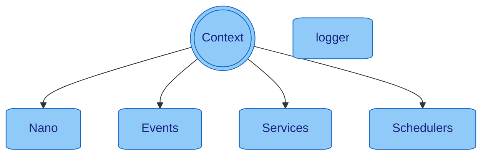

> [Home](../../README.md) / [Components](../../README.md#-components)

[**> Context <**](README.md)
| [Events](../events/README.md)
| [Schedulers](../schedulers/README.md)
| [Services](../services/README.md)

# Context

The [Context](../context/README.md) object is the main and overwhelming object that is passed around in Nano and accessible at any time.
It is used to interact with the core
components: [LogService](../services/logger/README.md), [Events](../events/README.md) , [Services](../services/README.md), [Schedulers](../schedulers/README.md),
traces and
[configuration](#configuration).
There is **no need to create any custom config** class as the [Context](../context/README.md) contains all needed
information including type conversion.

### Examples

#### Access Configs

* `context.asInt("app_config_key")` - Get a configuration value as an Integer
* `context.asList(Integer.class, "app_config_key")` - Get a configuration value as a List of Integers
* `context.asMap(String.class, Integer.class, "app_config_key")` - Get a configuration value as a Map of Strings to Integers
* `context.traceId()` - Get the trace id of the current [Context](../context/README.md)
* `context.logLevel()` - Get the log level of the current [Context](../context/README.md)
* `context.info(() -> "Hello {}", "World")` - Log a message with the [LogService](../services/logger/README.md) at the info
  level
* `context.newContext(MyClass.class)` - Create a new [Context](../context/README.md) with
  a [LogService](../services/logger/README.md) for the specific class

#### Events

* `context.registerChannelId("MyEventName")` - Register a new [Event](../events/README.md)  type and get the event id
* `context.newEvent(channelId).payload(MyPayloadObject).send()` - Send an [Event](../events/README.md)  with a payload
* `context.subscribeEvent(channelId, event -> System.out.println(event))` - Subscribe to an [Event](../events/README.md)
  and execute the lambda
  when the event is triggered
* `context.broadcastEvent(channelId, MyPayloadObject)` - Broadcast an [Event](../events/README.md) with a payload
* `context.eventNameOf(channelId)` - Get the name of an [Event](../events/README.md) from the event id
* `context.channelIdOf(eventName)` - Get the id of an [Event](../events/README.md) from the event name

#### Executors

* `context.run(() -> System.out.println("Scheduled"), 128, 256, MILLISECONDS)` - Run a lambda on
  a [Schedulers](../schedulers/README.md) with a 128ms delay and 256ms period
* `context.run(() -> System.out.println("Async Task"))` - Run a lambda asynchronously
* `context.runAwait(() -> System.out.println("Task 1"), ) -> System.out.println("Task 2"))` - Run a lambda
  asynchronously and wait for them to finish

## Configuration

The configuration can be set in multiple ways, with the following order of precedence:

| Order | Type                   | Description & examples                                                                                                    |
|-------|------------------------|---------------------------------------------------------------------------------------------------------------------------|
| 0     | Property Files         | `application.properties` config files, which gets automatically loaded from `config`, `resources`, and `resources/config` |
| 1     | Environment Variables  | `export app_profiles=production` variables that are set in the environment                                                |
| 2     | Command Line Arguments | `-Dapp_profiles=production` start parameters                                                                              |
| 3     | Args                   | `app_profiles=production` arguments that are passed to the `main` method of the application                               |
| 4     | Nano Start             | `new Nano(Map.of(CONFIG_LOG_LEVEL, TEST_LOG_LEVEL))` passing configuration at the start of nano                           |
| 5     | Defaults               | If no other configuration value is provided                                                                               |

To access the configuration, use the [Context](../context/README.md) object.
Available properties can be found by starting the application with the `--help` flag.

### Configuration Profiles

Profiles are used to define different configurations for different environments.
They can be set by using the `app_profiles` property. It is compatible with properties
like `spring.profiles.active`, `quarkus.profile`, `micronaut.profiles`, etc.
When using profiles, the corresponding `application-{profile}.properties` file will be loaded if present.

### Configuration format

You can use any configuration format which your system allows, Nano will convert every configuration key into the common
and widely accepted format which is lowercased with underscore separation. For example `app.profiles` will be converted
to `app_profiles`.

### Configuration naming patterns:

* `app_<key>` is reserved for Nano internal configurations
* `app_service_<servicename>_<key>` can be used for [Services](../services/README.md)
* `app_config_` is the prefix for custom configurations

### Configuration Variables

It's possible to use variables in the configuration files
Variables are defined in the format `${variableName}` or also `${variableName:fallback}`.

Example: `test.placeholder.value=${placeholder_value:fallback}`

### Default Configurations

| Config Name                         | Type    | Description                                                                                                                                                                       |
|-------------------------------------|---------|-----------------------------------------------------------------------------------------------------------------------------------------------------------------------------------|
| app_env_prod                        | Boolean | Enable or disable behaviour e.g. exit codes. This is useful in prod environments specially on error cases. default = `false`                                                      |
| app_log_formatter                   | String  | Log formatter `console` or `json`                                                                                                                                                 |
| app_log_level                       | String  | Log level for the application `INFO`, `DEBUG`, `FATAL`, `ERROR`, `WARN`                                                                                                           |
| app_oom_shutdown_threshold          | String  | Sets the threshold for heap in percentage to send an `EVENT_APP_OOM`. default = `98`, disabled = `-1`. If the event is unhandled, tha pp will try to shutdown with last resources |
| app_params_print                    | Boolean | Prints all configured values                                                                                                                                                      |
| app_profiles                        | String  | Is config for application profiles                                                                                                                                                |
| app_thread_pool_shutdown_timeout_ms | String  | Timeout for thread pool shutdown in milliseconds                                                                                                                                  |
| app_service_shutdown_parallel       | Boolean | Enable or disable parallel service shutdown. Enabled = Can increase the shutdown performance                                                                                      |
| help                                | Boolean | Lists available config keys without starting the application                                                                                                                      |

## Default Events

| In 🔲   Out 🔳 | [Event](../events/README.md)     | Payload                       | Response | Description                                                                                                                                        |
|--------------------|----------------------------------|-------------------------------|----------|----------------------------------------------------------------------------------------------------------------------------------------------------|
| 🔲                 | `EVENT_APP_START`                | `Nano`                        | `N/A`    | Triggered when the Application is started                                                                                                          |
| 🔲                 | `EVENT_APP_SHUTDOWN`             | `null`                        | `N/A`    | Triggered when the Application shuts down, can be also manually produced to shut down the Application                                              |
| 🔲                 | `EVENT_APP_SERVICE_REGISTER`     | `Service`                     | `N/A`    | Triggered when a [Service](../services/README.md) is started                                                                                       |
| 🔲                 | `EVENT_APP_SERVICE_UNREGISTER`   | `Service`                     | `N/A`    | Triggered when a [Service](../services/README.md) is stopped                                                                                       |
| 🔲                 | `EVENT_APP_SCHEDULER_REGISTER`   | `Scheduler`                   | `N/A`    | Triggered when a [Scheduler](../schedulers/README.md) is started                                                                                   |
| 🔲                 | `EVENT_APP_SCHEDULER_UNREGISTER` | `Scheduler`                   | `N/A`    | Triggered when a [Scheduler](../schedulers/README.md) is stopped                                                                                   |
| 🔲                 | `EVENT_APP_UNHANDLED`            | `Unhandled`, `HttpObject`,... | `N/A`    | Triggered when an unhandled error happened within the context                                                                                      |
| 🔲                 | `EVENT_APP_OOM`                  | `Double`                      | `N/A`    | Triggered when the Application reached out of memory. When the event is not handled, the App will shutdown see config `app_oom_shutdown_threshold` |
| 🔲                 | `EVENT_APP_HEARTBEAT`            | `Nano`                        | `N/A`    | Send every 256ms                                                                                                                                   |
| 🔳                 | `EVENT_CONFIG_CHANGE`            | `TypeMap`                     | `N/A`    | Used to change configs on the fly                                                                                                                  |

