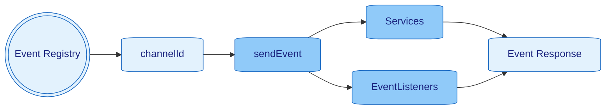

> [Home](../../README.md) / [Components](../../README.md#-components)

 [Context](../context/README.md)
| [**> Events <**](README.md)
| [Logger](../logger/README.md)
| [Schedulers](../schedulers/README.md)
| [Services](../services/README.md)

# Events

[Events](../events/README.md) are the backbone of communication within the Nano Framework, to decoupled interaction between different parts of
an application.
They are a core API concept for using [Services](../services/README.md).
See [Event.java](../../src/main/java/org/nanonative/nano/helper/event/model/Event.java)

## ChannelIds

`ChannelIds` are globally, unique IDs to identify the right channel to send events into,
They can be registered once with `ChannelIdRegister.registerChannelId("MY_EVENT_NAME");` -
see [EventChanelRegister.java](../../src/main/java/org/nanonative/nano/helper/event/EventChannelRegister.java)
and [DefaultEventChannel](../../src/main/java/org/nanonative/nano/helper/event/model/EventChannel.java)

## Sending Events

[Events](../events/README.md) can be sent **synchronous**, **asynchronous**, **single cast** or **broadcast**.

* synchronous (SingleCast)
  * `context.sendEvent(channelId, MyPayloadObject)`
  * `sendEventReturn()` will return the Event instead of the Context
* asynchronous (SingleCast)
  * `context.sendEvent(channelId, MyPayloadObject, response -> myListener)`
  * `sendEventReturn()` will return the Event instead of the Context

* synchronous (BroadCast)
  * `context.broadcastEvent(channelId, MyPayloadObject)`
  * `broadcastEventReturn()` will return the Event instead of the Context
  * _broadcast will not stop at the first responding listeners_
* asynchronous (BroadCast)
  * `context.broadcastEvent(channelId, MyPayloadObject, response -> myListener)`
  * `broadcastEventReturn()` will return the Event instead of the Context
  * _broadcast will not stop at the first responding listeners_

# Listening to Events

Listeners can be easily registered with `context.subscribeEvent(channelId, event -> System.out.println(event))`.
[Services](../services/README.md)  don't need to subscribe or unsubscribe to [Events](../events/README.md) as they are
managed and receive the
[Events](../events/README.md) through the build
in method `onEvent`

## Default Events

| In 🔲   Out 🔳 | [Event](../events/README.md)     | Payload                       | Response | Description                                                                                                                                        |
|--------------------|----------------------------------|-------------------------------|----------|----------------------------------------------------------------------------------------------------------------------------------------------------|
| 🔲                 | `EVENT_APP_START`                | `Nano`                        | `N/A`    | Triggered when the Application is started                                                                                                          |
| 🔲                 | `EVENT_APP_SHUTDOWN`             | `null`                        | `N/A`    | Triggered when the Application shuts down, can be also manually produced to shut down the Application                                              |
| 🔲                 | `EVENT_APP_SERVICE_REGISTER`     | `Service`                     | `N/A`    | Triggered when a [Service](../services/README.md) is started                                                                                       |
| 🔲                 | `EVENT_APP_SERVICE_UNREGISTER`   | `Service`                     | `N/A`    | Triggered when a [Service](../services/README.md) is stopped                                                                                       |
| 🔲                 | `EVENT_APP_SCHEDULER_REGISTER`   | `Scheduler`                   | `N/A`    | Triggered when a [Scheduler](../schedulers/README.md) is started                                                                                   |
| 🔲                 | `EVENT_APP_SCHEDULER_UNREGISTER` | `Scheduler`                   | `N/A`    | Triggered when a [Scheduler](../schedulers/README.md) is stopped                                                                                   |
| 🔲                 | `EVENT_APP_UNHANDLED`            | `Unhandled`, `HttpObject`,... | `N/A`    | Triggered when an unhandled error happened within the context                                                                                      |
| 🔲                 | `EVENT_APP_OOM`                  | `Double`                      | `N/A`    | Triggered when the Application reached out of memory. When the event is not handled, the App will shutdown see config `app_oom_shutdown_threshold` |
| 🔲                 | `EVENT_APP_HEARTBEAT`            | `Nano`                        | `N/A`    | Send every 256ms                                                                                                                                   |
| 🔳                 | `EVENT_CONFIG_CHANGE`            | `TypeMap`                     | `N/A`    | Used to change configs on the fly                                                                                                                  |

