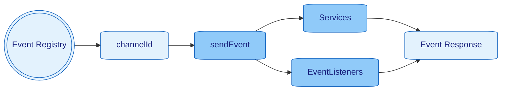

> [Home](../../README.md) / [Components](../../README.md#-components)

 [Context](../context/README.md)
| [**> Events <**](README.md)
| [Schedulers](../schedulers/README.md)
| [Services](../services/README.md)

# Events

**Events are the Heart of Nano's Architecture**

[Events](../events/README.md) are the backbone of communication within Nano, enabling **decoupled interaction** between different parts of your application. Everything in Nano flows through events - HTTP requests, database operations, errors, and even configuration changes.

**Key Concepts:**
- **Event-Driven Communication**: All components communicate through events, not direct method calls
- **Static Event Listeners**: Your business logic lives in static methods that subscribe to events
- **Universal Services**: Services react to events to handle external integrations
- **Global Error Handling**: Even errors are events that can be subscribed to and handled globally
- **TypeMap Integration**: Events carry TypeMap data for easy type conversion and transformation

See [Event.java](../../src/main/java/org/nanonative/nano/helper/event/model/Event.java)



## ChannelIds

`ChannelIds` are globally, unique IDs to identify the right channel to send events into,
They can be registered once with `ChannelIdRegister.registerChannelId("MY_EVENT_NAME");` -
see [EventChanelRegister.java](../../src/main/java/org/nanonative/nano/helper/event/EventChannelRegister.java)
and [DefaultEventChannel](../../src/main/java/org/nanonative/nano/helper/event/model/EventChannel.java)

## Sending Events

[Events](../events/README.md) can be sent **synchronous**, **asynchronous**, **single cast** or **broadcast**. Events are the primary communication mechanism in Nano, enabling decoupled interaction between components.

### Event Creation and Sending

**Basic Event Sending:**
```java
// Synchronous single cast
context.newEvent(EVENT_USER_CREATED)
    .payload(Map.of("userId", 123, "name", "John Doe"))
    .send();

// Asynchronous single cast
context.newEvent(EVENT_USER_CREATED)
    .payload(Map.of("userId", 123, "name", "John Doe"))
    .async(true)
    .send();

// Synchronous broadcast (all listeners receive the event)
context.newEvent(EVENT_USER_CREATED)
    .payload(Map.of("userId", 123, "name", "John Doe"))
    .broadcast(true)
    .send();

// Asynchronous broadcast
context.newEvent(EVENT_USER_CREATED)
    .payload(Map.of("userId", 123, "name", "John Doe"))
    .broadcast(true)
    .async(true)
    .send();
```

### Request-Response Pattern

**Synchronous Request-Response:**
```java
// Send event and wait for response
final Event<TypeMap, TypeMap> response = context.newEvent(EVENT_DATABASE_QUERY)
    .payload(Map.of("query", "SELECT * FROM users WHERE id = ?", "params", Map.of("id", userId)))
    .send();

// Get response data
final TypeMap userData = response.response();
final String userName = userData.asString("name");
```

**Asynchronous Request-Response:**
```java
// Send event asynchronously with response handler
context.newEvent(EVENT_DATABASE_QUERY)
    .payload(Map.of("query", "SELECT * FROM users WHERE id = ?", "params", Map.of("id", userId)))
    .async(response -> {
        final TypeMap userData = response.response();
        context.info(() -> "User found: {}", userData.asString("name"));
    })
    .send();
```

### Event Broadcasting

**Broadcast to Multiple Listeners:**
```java
// Broadcast user update to all interested services
context.broadcastEvent(EVENT_USER_UPDATED, Map.of(
    "userId", 123,
    "changes", Map.of("email", "new@example.com"),
    "timestamp", System.currentTimeMillis()
));

// Services like EmailService, CacheService, AuditService will all receive this event
```

### Event Filtering and Conditional Sending

**Conditional Event Sending:**
```java
// Only send event if condition is met
if (user.isActive()) {
    context.newEvent(EVENT_ACTIVE_USER_ACTION)
        .payload(Map.of("userId", user.getId(), "action", "login"))
        .send();
}

// Send event with retry logic
context.newEvent(EVENT_CRITICAL_OPERATION)
    .payload(operationData)
    .async(response -> {
        if (response.error() != null) {
            // Retry after delay
            context.run(() -> {
                context.newEvent(EVENT_CRITICAL_OPERATION)
                    .payload(operationData)
                    .send();
            }, 5, TimeUnit.SECONDS);
        }
    })
    .send();
```

### Event Error Handling

**Error Events:**
```java
// Send error event
context.newEvent(EVENT_OPERATION_FAILED)
    .payload(Map.of("operation", "user_creation", "error", "Validation failed"))
    .error(new ValidationException("Invalid email format"))
    .send();

// Handle error events
context.subscribeError(EVENT_OPERATION_FAILED, event -> {
    context.error(() -> "Operation failed: {}", event.error().getMessage());
    // Implement error recovery logic
});
```

### Event Chaining and Composition

**Event Chaining:**
```java
// Chain multiple events
public static void processUserRegistration(Event<HttpObject, HttpObject> event) {
    final TypeMap userData = event.payloadAsMap();
    
    // Step 1: Validate user data
    context.newEvent(EVENT_VALIDATE_USER)
        .payload(userData)
        .async(validationResponse -> {
            if (validationResponse.error() != null) {
                event.payload().createResponse()
                    .statusCode(400)
                    .body(Map.of("error", "Validation failed"))
                    .respond(event);
                return;
            }
            
            // Step 2: Create user in database
            context.newEvent(EVENT_CREATE_USER)
                .payload(userData)
                .async(createResponse -> {
                    if (createResponse.error() != null) {
                        event.payload().createResponse()
                            .statusCode(500)
                            .body(Map.of("error", "User creation failed"))
                            .respond(event);
                        return;
                    }
                    
                    // Step 3: Send welcome email
                    context.newEvent(EVENT_SEND_WELCOME_EMAIL)
                        .payload(Map.of("userId", createResponse.response().asString("id")))
                        .async(emailResponse -> {
                            // Step 4: Send success response
                            event.payload().createResponse()
                                .statusCode(201)
                                .body(Map.of("userId", createResponse.response().asString("id")))
                                .respond(event);
                        })
                        .send();
                })
                .send();
        })
        .send();
}
```

### Event Timing and Scheduling

**Delayed Event Sending:**
```java
// Send event after delay
context.run(() -> {
    context.newEvent(EVENT_SEND_REMINDER)
        .payload(Map.of("userId", userId, "message", "Please complete your profile"))
        .send();
}, 24, TimeUnit.HOURS);

// Send event at specific time
context.runDaily(() -> {
    context.newEvent(EVENT_DAILY_REPORT)
        .payload(Map.of("date", LocalDate.now().toString()))
        .send();
}, LocalTime.of(9, 0, 0));
```

### Event Monitoring and Metrics

**Event Metrics:**
```java
// Track event metrics
context.newEvent(EVENT_METRICS_UPDATE)
    .payload(Map.of(
        "metric", "events_sent",
        "value", 1,
        "tags", Map.of("event_type", "user_created")
    ))
    .send();

// Monitor event processing time
final long startTime = System.nanoTime();
context.newEvent(EVENT_PROCESS_DATA)
    .payload(data)
    .async(response -> {
        final long duration = System.nanoTime() - startTime;
        context.info(() -> "Event processed in {} ms", duration / 1_000_000);
    })
    .send();
```

# Listening to Events

**Static Event Listeners - The Nano Way**

In Nano, you don't create service objects with business logic. Instead, you create **static methods** that subscribe to events and react to them. This functional approach eliminates the need for complex object hierarchies.

### Static Event Listeners

```java
public class UserController {
    
    // Static method handles HTTP requests - no @Controller needed!
    public static void handleUserRegistration(Event<HttpObject, HttpObject> event) {
        event.payloadOpt()
            .filter(HttpObject::isMethodPost)
            .filter(req -> req.pathMatch("/api/users/register"))
            .ifPresent(req -> {
                // Business logic here - no objects, no state!
                final TypeMap userData = req.bodyAsJson().asMap();
                event.context().sendEvent(EVENT_CREATE_USER, userData);
                request.createResponse().statusCode(201).respond(event);
            });
    }
    
    // Static method handles user login
    public static void handleUserLogin(Event<HttpObject, HttpObject> event) {
        event.payloadOpt()
            .filter(HttpObject::isMethodPost)
            .filter(req -> req.pathMatch("/api/users/login"))
            .ifPresent(req -> {
                final TypeMap loginData = req.bodyAsJson().asMap();
                TypeMap user = event.context().sendEvent(EVENT_AUTHENTICATE_USER, loginData).response();
                request.createResponse().statusCode(200).body(user).respond(event);
            });
    }
}

// Register static listeners
nano.subscribeEvent(EVENT_HTTP_REQUEST, UserController::handleUserRegistration);
nano.subscribeEvent(EVENT_HTTP_REQUEST, UserController::handleUserLogin);
```

### Service Event Handling

[Services](../services/README.md) don't need to subscribe or unsubscribe to [Events](../events/README.md) as they are managed and receive events through the built-in method `onEvent`:

```java
public class DatabaseService extends Service {
    
    @Override
    public void onEvent(Event<?, ?> event) {
        // Handle different database operations through events
        if (event.isEvent(EVENT_CREATE_USER)) {
            createUser(event.payloadAsMap());
        } else if (event.isEvent(EVENT_AUTHENTICATE_USER)) {
            authenticateUser(event.payloadAsMap());
        }
        // No business logic here - just database operations!
    }
}
```

## Default Events

| In 🔲 <br/> Out 🔳 | [Event](../events/README.md)     | Payload                       | Response | Description                                                                                                                                        |
|--------------------|----------------------------------|-------------------------------|----------|----------------------------------------------------------------------------------------------------------------------------------------------------|
| 🔲                 | `EVENT_APP_START`                | `Nano`                        | `N/A`    | Triggered when the Application is started                                                                                                          |
| 🔲                 | `EVENT_APP_SHUTDOWN`             | `null`                        | `N/A`    | Triggered when the Application shuts down, can be also manually produced to shut down the Application                                              |
| 🔲                 | `EVENT_APP_SERVICE_REGISTER`     | `Service`                     | `N/A`    | Triggered when a [Service](../services/README.md) is started                                                                                       |
| 🔲                 | `EVENT_APP_SERVICE_UNREGISTER`   | `Service`                     | `N/A`    | Triggered when a [Service](../services/README.md) is stopped                                                                                       |
| 🔲                 | `EVENT_APP_SCHEDULER_REGISTER`   | `Scheduler`                   | `N/A`    | Triggered when a [Scheduler](../schedulers/README.md) is started                                                                                   |
| 🔲                 | `EVENT_APP_SCHEDULER_UNREGISTER` | `Scheduler`                   | `N/A`    | Triggered when a [Scheduler](../schedulers/README.md) is stopped                                                                                   |
| 🔲                 | `EVENT_APP_UNHANDLED`            | `Unhandled`, `HttpObject`,... | `N/A`    | Triggered when an unhandled error happened within the context                                                                                      |
| 🔲                 | `EVENT_APP_OOM`                  | `Double`                      | `N/A`    | Triggered when the Application reached out of memory. When the event is not handled, the App will shutdown see config `app_oom_shutdown_threshold` |
| 🔲                 | `EVENT_APP_HEARTBEAT`            | `Nano`                        | `N/A`    | Send every 256ms                                                                                                                                   |
| 🔳                 | `EVENT_CONFIG_CHANGE`            | `TypeMap`                     | `N/A`    | Used to change configs on the fly for services which supports it                                                                                   |

