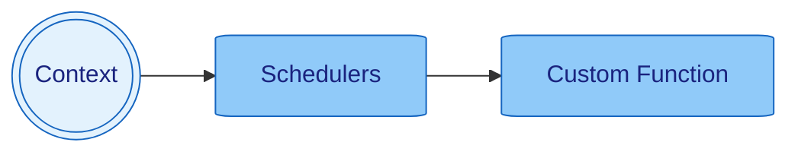

> [Home](../../README.md) / [Components](../../README.md#-components)

 [Context](../context/README.md)
| [Events](../events/README.md)
| [**> Schedulers <**](README.md)
| [Services](../services/README.md)

# Schedulers

[Schedulers](../schedulers/README.md) are managed functions which run in the background.

## Examples

* Run once with delay (128ms)
    * `context.run(() -> System.out.println("Scheduled"), 128, MILLISECONDS)`
* Run periodically (evey 256ms) with initial delay (128ms)
    * `context.run(() -> System.out.println("Scheduled"), 128, 256, MILLISECONDS)`
* Run at specific time (8:00:00)
    * `context.run(System.out.println("Scheduled"), LocalTime.of(8,0,0))`
* Run at specific time (8:00:00) on specific day (Monday)
    * `context.run(() -> {}, LocalTime.of(8,0,0), DayOfWeek.MONDAY)`
