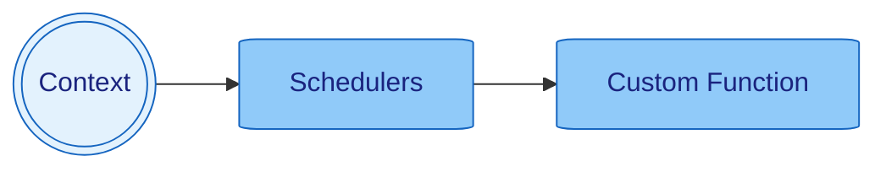

> [Home](../../README.md) / [Components](../../README.md#-components)

 [Context](../context/README.md)
| [Events](../events/README.md)
| [**> Schedulers <**](README.md)
| [Services](../services/README.md)

# Schedulers

**Schedulers - Background Task Management in Nano**

[Schedulers](../schedulers/README.md) are managed functions that run in the background, providing powerful scheduling capabilities for periodic tasks, delayed execution, and time-based operations. Nano's scheduler system is built on Java's `ScheduledExecutorService` and provides a fluent API for common scheduling patterns.



## Scheduler Types

Nano provides several types of schedulers for different use cases:

### 1. Delayed Execution
Run a task once after a specified delay:

```java
// Run once after 5 seconds
context.run(() -> {
    context.info(() -> "Task executed after delay");
}, 5, TimeUnit.SECONDS);
```

### 2. Periodic Execution
Run a task repeatedly with a fixed interval:

```java
// Run every 30 seconds, starting after 10 seconds
context.run(() -> {
    context.info(() -> "Periodic task executed");
}, 10, 30, TimeUnit.SECONDS);
```

### 3. Daily Execution
Run a task daily at a specific time:

```java
// Run daily at 8:00 AM
context.runDaily(() -> {
    context.info(() -> "Daily backup started");
}, LocalTime.of(8, 0, 0));

// Run daily at 2:30 PM with stop condition
context.runDaily(() -> {
    context.info(() -> "Daily report generated");
}, () -> shouldStopDailyReports(), LocalTime.of(14, 30, 0));
```

### 4. Weekly Execution
Run a task weekly on a specific day and time:

```java
// Run every Monday at 9:00 AM
context.runWeekly(() -> {
    context.info(() -> "Weekly maintenance started");
}, LocalTime.of(9, 0, 0), DayOfWeek.MONDAY);

// Run every Friday at 5:00 PM with stop condition
context.runWeekly(() -> {
    context.info(() -> "Weekly summary generated");
}, LocalTime.of(17, 0, 0), () -> shouldStopWeeklyReports(), DayOfWeek.FRIDAY);
```

### 5. Advanced Scheduling
Run tasks with custom time zones and complex conditions:

```java
// Run daily at 6:00 AM in a specific timezone
context.run(() -> {
    context.info(() -> "Timezone-specific task executed");
}, LocalTime.of(6, 0, 0), null, ZoneId.of("America/New_York"), () -> false);

// Run weekly on Tuesday at 3:00 PM with custom stop condition
context.run(() -> {
    context.info(() -> "Custom weekly task executed");
}, LocalTime.of(15, 0, 0), DayOfWeek.TUESDAY, ZoneId.systemDefault(), () -> isMaintenanceMode());
```

## Scheduler Management

### Accessing Active Schedulers
```java
// Get all active schedulers
final Set<ScheduledExecutorService> schedulers = context.nano().schedulers();
context.info(() -> "Active schedulers: {}", schedulers.size());
```

### Stop Conditions
Use `BooleanSupplier` to create dynamic stop conditions:

```java
// Run until a condition is met
context.run(() -> {
    context.info(() -> "Processing batch");
    processBatch();
}, 0, 60, TimeUnit.SECONDS, () -> isShutdownRequested());
```

## Best Practices

1. **Use Appropriate Time Units**: Choose the right `TimeUnit` for your use case
2. **Handle Exceptions**: Always wrap scheduled tasks in try-catch blocks
3. **Log Scheduler Activity**: Use context logging to track scheduler execution
4. **Use Stop Conditions**: Implement proper stop conditions for long-running tasks
5. **Consider Time Zones**: Use appropriate time zones for time-based scheduling
6. **Resource Cleanup**: Ensure scheduled tasks clean up resources properly

### Monitoring and Metrics
```java
// Collect metrics every minute
context.run(() -> {
    final Map<String, Object> metrics = collectSystemMetrics();
    context.sendEvent(EVENT_METRICS_UPDATE, metrics);
}, 0, 60, TimeUnit.SECONDS);
```
