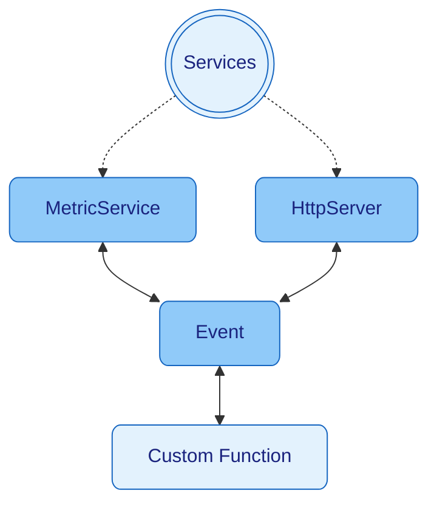

> [Home](../../README.md) / [Components](../../README.md#-components)

 [Context](../context/README.md)
| [Events](../events/README.md)
| [Schedulers](../schedulers/README.md)
| [**> Services <**](README.md)

# Services

[Services](../services/README.md) are extensions for Nano which are independent managed programs that are running in the
background.
They are usually designed to be accessed by [Events](../events/README.md).
Nano has default [Services](../services/README.md)
like [HttpServer](httpserver/README.md), [MetricService](metricservice/README.md), [LogService](../services/logger/README.md)

## Start Services

* `new Nano(new MetricService(), new HttpServer(), new HttpClient())` - [Services](../services/README.md) will start with
  Nano Startup
* `context.run(new HttpServer())` - Service start

