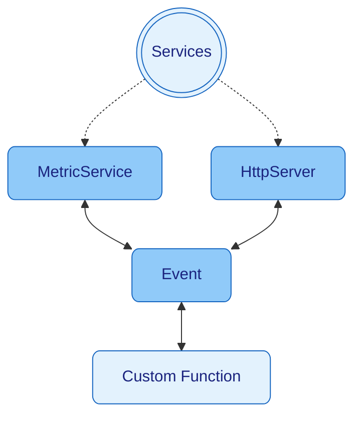

> [Home](../../README.md) / [Components](../../README.md#-components)

 [Context](../context/README.md)
| [Events](../events/README.md)
| [Schedulers](../schedulers/README.md)
| [**> Services <**](README.md)

# Services

**Services in Nano are Universal Connectors, Not Business Objects**

[Services](../services/README.md) in Nano are **universal connectors** for external systems - databases, HTTP services, queues, and other technologies. They are designed to be pure infrastructure adapters that contain **no business logic**.

**Key Principles:**
- **No Business Logic**: Services handle external integrations only - no domain logic
- **Event-Driven**: Services communicate through events, not direct method calls  
- **Universal Design**: One service can handle multiple types of external systems
- **Easy Testing**: Services can be easily replaced with fake implementations in tests
- **Decoupled Architecture**: Business logic stays in static methods, infrastructure in services

Nano comes with built-in [Services](../services/README.md) like [HttpServer](httpserver/README.md), [MetricService](metricservice/README.md), [LogService](../services/logger/README.md) that handle common external integrations.

## Service Architecture

**Services as Universal Connectors**

Services in Nano are designed to be **universal connectors** that handle external system integrations without containing any business logic. This clear separation between infrastructure and business logic makes your application more maintainable and testable.

### Starting Services

* `new Nano(new MetricService(), new HttpServer(), new HttpClient())` - [Services](../services/README.md) will start with Nano startup
* `context.run(new HttpServer())` - Start a service dynamically

### Service Design Pattern

Services in Nano extend the `Service` abstract class and implement the required methods. All methods are optional and have safe default behaviors, allowing for minimal implementations.

```java
public class DatabaseService extends Service {
    
    private Connection connection;
    private String connectionUrl;
    
    @Override
    public void start() {
        // Initialize database connection
        this.connectionUrl = context.asString("app_config_database_url");
        this.connection = createConnection(connectionUrl);
        context.info(() -> "Database service started with URL: {}", connectionUrl);
    }
    
    @Override
    public void stop() {
        // Clean up resources
        if (connection != null) {
            try {
                connection.close();
                context.info(() -> "Database connection closed");
            } catch (Exception e) {
                context.error(() -> "Error closing database connection: {}", e.getMessage());
            }
        }
    }
    
    @Override
    public void onEvent(Event<?, ?> event) {
        // Handle different database operations through events
        if (event.isEvent(EVENT_DATABASE_QUERY)) {
            final TypeMap queryData = event.payloadAsMap();
            final String sql = queryData.asString("query");
            final TypeMap params = queryData.asMap("params");
            
            try {
                final List<TypeMap> results = executeQuery(sql, params);
                event.reply(results);
            } catch (Exception e) {
                context.error(() -> "Database query failed: {}", e.getMessage());
                event.error(e);
            }
        } else if (event.isEvent(EVENT_DATABASE_INSERT)) {
            final TypeMap insertData = event.payloadAsMap();
            final String table = insertData.asString("table");
            final TypeMap values = insertData.asMap("values");
            
            try {
                final long id = insertRecord(table, values);
                event.reply(Map.of("id", id, "success", true));
            } catch (Exception e) {
                context.error(() -> "Database insert failed: {}", e.getMessage());
                event.error(e);
            }
        }
        // No business logic here - just database operations!
    }
    
    @Override
    public void configure(TypeMapI<?> changes, TypeMapI<?> merged) {
        // Called when configuration changes - services can adapt dynamically
        if (changes.containsKey("app_config_database_url")) {
            final String newUrl = merged.asString("app_config_database_url");
            if (!newUrl.equals(connectionUrl)) {
                context.info(() -> "Database URL changed, reconnecting...");
                restart();
            }
        }
    }
    
    @Override
    public Object onFailure(Event<?, ?> error) {
        // Handle service failures
        context.error(() -> "Database service error: {}", error.error().getMessage());
        
        // Try to reconnect
        try {
            restart();
            return Map.of("reconnected", true, "error", error.error().getMessage());
        } catch (Exception e) {
            return Map.of("reconnected", false, "error", e.getMessage());
        }
    }
    
    private void restart() {
        stop();
        start();
    }
    
    private Connection createConnection(String url) throws SQLException {
        // Implementation here
        return null;
    }
    
    private List<TypeMap> executeQuery(String sql, TypeMap params) throws SQLException {
        // Implementation here
        return List.of();
    }
    
    private long insertRecord(String table, TypeMap values) throws SQLException {
        // Implementation here
        return 0L;
    }
}
```

### Service Lifecycle Methods

**Required Methods:**
- `start()` - Called during service initialization
- `stop()` - Called during service shutdown
- `onEvent(Event<?, ?> event)` - Handles incoming events
- `configure(TypeMapI<?> changes, TypeMapI<?> merged)` - Handles configuration changes
- `onFailure(Event<?, ?> error)` - Handles service failures

**Key Points:**
- **Event-Driven**: Services react to events, not direct method calls
- **No Business Logic**: Only infrastructure operations (database, HTTP, etc.)
- **Dynamic Configuration**: Services can adapt to configuration changes on the fly
- **Error Handling**: Services can handle their own failures and recovery
- **Easy Testing**: Replace with fake implementations for testing

## Real-World Service Examples

### Email Service
```java
public class EmailService extends Service {
    
    private SmtpClient smtpClient;
    private String smtpHost;
    private int smtpPort;
    private String username;
    private String password;
    
    @Override
    public void start() {
        this.smtpHost = context.asString("app_config_smtp_host", "localhost");
        this.smtpPort = context.asInt("app_config_smtp_port", 587);
        this.username = context.asString("app_config_smtp_username");
        this.password = context.asString("app_config_smtp_password");
        
        this.smtpClient = new SmtpClient(smtpHost, smtpPort, username, password);
        context.info(() -> "Email service started with host: {}", smtpHost);
    }
    
    @Override
    public void stop() {
        if (smtpClient != null) {
            smtpClient.close();
            context.info(() -> "Email service stopped");
        }
    }
    
    @Override
    public void onEvent(Event<?, ?> event) {
        if (event.isEvent(EVENT_SEND_EMAIL)) {
            final TypeMap emailData = event.payloadAsMap();
            final String to = emailData.asString("to");
            final String subject = emailData.asString("subject");
            final String body = emailData.asString("body");
            
            try {
                smtpClient.sendEmail(to, subject, body);
                event.reply(Map.of("success", true, "messageId", UUID.randomUUID().toString()));
                context.info(() -> "Email sent to: {}", to);
            } catch (Exception e) {
                context.error(() -> "Failed to send email to {}: {}", to, e.getMessage());
                event.error(e);
            }
        }
    }
    
    @Override
    public void configure(TypeMapI<?> changes, TypeMapI<?> merged) {
        if (changes.containsKey("app_config_smtp_host") || 
            changes.containsKey("app_config_smtp_port")) {
            context.info(() -> "SMTP configuration changed, reconnecting...");
            restart();
        }
    }
    
    @Override
    public Object onFailure(Event<?, ?> error) {
        context.error(() -> "Email service error: {}", error.error().getMessage());
        return Map.of("retry", true, "error", error.error().getMessage());
    }
}
```

### Cache Service
```java
public class CacheService extends Service {
    
    private Map<String, Object> cache = new ConcurrentHashMap<>();
    private Duration defaultTtl;
    
    @Override
    public void start() {
        final long ttlSeconds = context.asLong("app_config_cache_ttl_seconds", 3600);
        this.defaultTtl = Duration.ofSeconds(ttlSeconds);
        context.info(() -> "Cache service started with TTL: {} seconds", ttlSeconds);
    }
    
    @Override
    public void stop() {
        cache.clear();
        context.info(() -> "Cache service stopped, cleared {} entries", cache.size());
    }
    
    @Override
    public void onEvent(Event<?, ?> event) {
        if (event.isEvent(EVENT_CACHE_GET)) {
            final String key = event.payloadAsString();
            final Object value = cache.get(key);
            event.reply(Map.of("key", key, "value", value, "found", value != null));
            
        } else if (event.isEvent(EVENT_CACHE_PUT)) {
            final TypeMap cacheData = event.payloadAsMap();
            final String key = cacheData.asString("key");
            final Object value = cacheData.as("value");
            final Duration ttl = cacheData.as(Duration.class, "ttl", defaultTtl);
            
            cache.put(key, value);
            
            // Schedule expiration
            context.run(() -> cache.remove(key), ttl.toMillis(), TimeUnit.MILLISECONDS);
            
            event.reply(Map.of("key", key, "success", true));
            context.debug(() -> "Cached key: {} with TTL: {}", key, ttl);
            
        } else if (event.isEvent(EVENT_CACHE_CLEAR)) {
            final int size = cache.size();
            cache.clear();
            event.reply(Map.of("cleared", size, "success", true));
            context.info(() -> "Cache cleared, removed {} entries", size);
        }
    }
    
    @Override
    public void configure(TypeMapI<?> changes, TypeMapI<?> merged) {
        if (changes.containsKey("app_config_cache_ttl_seconds")) {
            final long newTtl = merged.asLong("app_config_cache_ttl_seconds");
            this.defaultTtl = Duration.ofSeconds(newTtl);
            context.info(() -> "Cache TTL updated to: {} seconds", newTtl);
        }
    }
}
```

### File Storage Service
```java
public class FileStorageService extends Service {
    
    private Path storagePath;
    private long maxFileSize;
    
    @Override
    public void start() {
        final String basePath = context.asString("app_config_storage_path", "./storage");
        this.storagePath = Paths.get(basePath);
        this.maxFileSize = context.asLong("app_config_max_file_size", 10 * 1024 * 1024); // 10MB
        
        try {
            Files.createDirectories(storagePath);
            context.info(() -> "File storage service started at: {}", storagePath);
        } catch (IOException e) {
            context.error(() -> "Failed to create storage directory: {}", e.getMessage());
            throw new RuntimeException(e);
        }
    }
    
    @Override
    public void stop() {
        context.info(() -> "File storage service stopped");
    }
    
    @Override
    public void onEvent(Event<?, ?> event) {
        if (event.isEvent(EVENT_FILE_UPLOAD)) {
            final TypeMap fileData = event.payloadAsMap();
            final String filename = fileData.asString("filename");
            final byte[] content = fileData.as(byte[].class, "content");
            
            if (content.length > maxFileSize) {
                event.error(new IllegalArgumentException("File too large: " + content.length));
                return;
            }
            
            try {
                final Path filePath = storagePath.resolve(filename);
                Files.write(filePath, content);
                
                final String fileId = UUID.randomUUID().toString();
                event.reply(Map.of("fileId", fileId, "filename", filename, "size", content.length));
                context.info(() -> "File uploaded: {} ({} bytes)", filename, content.length);
                
            } catch (IOException e) {
                context.error(() -> "Failed to save file {}: {}", filename, e.getMessage());
                event.error(e);
            }
            
        } else if (event.isEvent(EVENT_FILE_DOWNLOAD)) {
            final String fileId = event.payloadAsString();
            final Path filePath = storagePath.resolve(fileId);
            
            try {
                if (Files.exists(filePath)) {
                    final byte[] content = Files.readAllBytes(filePath);
                    event.reply(Map.of("content", content, "filename", filePath.getFileName().toString()));
                } else {
                    event.error(new FileNotFoundException("File not found: " + fileId));
                }
            } catch (IOException e) {
                context.error(() -> "Failed to read file {}: {}", fileId, e.getMessage());
                event.error(e);
            }
        }
    }
}
```

## Service Communication Patterns

### Request-Response Pattern
```java
// In your business logic (static method)
public static void handleUserRequest(Event<HttpObject, HttpObject> event) {
    final TypeMap userData = event.payloadAsMap();
    
    // Send request to database service
    final Event<TypeMap, TypeMap> dbEvent = event.context()
        .newEvent(EVENT_DATABASE_QUERY)
        .payload(Map.of("query", "SELECT * FROM users WHERE id = ?", "params", Map.of("id", userData.asString("userId"))))
        .send();
    
    // Get response from database service
    final TypeMap user = dbEvent.response();
    
    // Send response back to HTTP client
    event.payload().createResponse()
        .body(user)
        .respond(event);
}
```

### Broadcast Pattern
```java
// Broadcast to multiple services
public static void notifyUserUpdate(Event<HttpObject, HttpObject> event) {
    final TypeMap userData = event.payloadAsMap();
    
    // Broadcast to all interested services
    event.context().broadcastEvent(EVENT_USER_UPDATED, userData);
    
    // Services like EmailService, CacheService, etc. will all receive this event
}
```

### Error Handling Pattern
```java
// Service error handling
@Override
public Object onFailure(Event<?, ?> error) {
    context.error(() -> "Service {} failed: {}", name(), error.error().getMessage());
    
    // Implement retry logic
    if (shouldRetry(error)) {
        context.run(() -> {
            try {
                restart();
                context.info(() -> "Service {} restarted successfully", name());
            } catch (Exception e) {
                context.error(() -> "Failed to restart service {}: {}", name(), e.getMessage());
            }
        }, 5, TimeUnit.SECONDS);
    }
    
    return Map.of("retry", shouldRetry(error), "error", error.error().getMessage());
}
```


